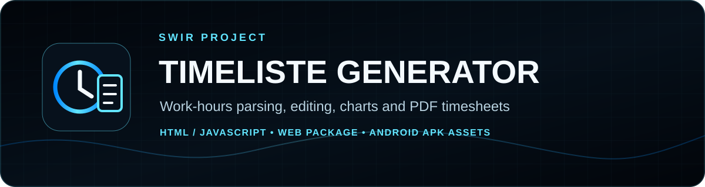
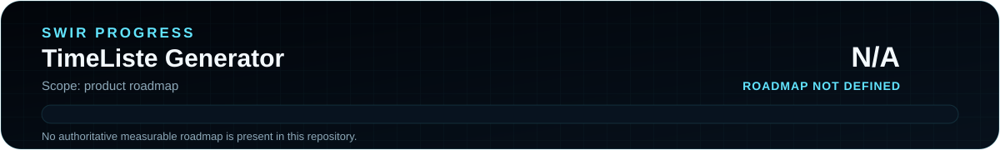

<!-- SWIR-README-STANDARD:v2 -->

<div align="center">



<br>


[](https://github.com/Swir)
[](https://github.com/Swir/TimeListe-Generator/releases)

[**Highlights**](#-highlights) · [**Quick Start**](#-quick-start) · [**Progress**](#-progress) · [**Releases**](#-releases)

</div>


## 📍 Project Status

<p align="center">
  
</p>

| Item | Status |
|---|---|
| Current stage | Maintained browser utility |
| Primary implementation | `html/v5.html` |
| Interface languages | English, Polish, Norwegian |
| Latest public release | [v5.0.0](https://github.com/Swir/TimeListe-Generator/releases/tag/v5.0.0) |
| Release formats | Web ZIP + Android APK assets + SHA256 sums |
| Product roadmap | Not defined — progress is intentionally **N/A** |

## 🚀 Overview

**TimeListe Generator** is a self-contained browser timesheet tool that turns loosely formatted work logs into editable work-time rows. The current `html/v5.html` interface can parse dates, client/location text, time ranges and decimal/hour-style durations, calculate totals, edit generated entries, filter records, show charts and export PDF documents.

The same web interface includes English, Polish and Norwegian UI dictionaries plus dark/light themes. The repository also stores Android APK builds and publishes them together with the web package.

## ✨ Highlights

| Feature | What it does |
|---|---|
| ⏱️ Raw-log parser | Converts flexible text lines into date, client, start/end and worked-time rows |
| ✏️ Editable records | Lets the user correct parsed date, client, times and duration before export |
| 🧮 Work-time totals | Calculates the combined duration of the current list |
| 🔎 Filtering | Filters by client and minimum worked hours |
| 📊 Statistics | Uses Chart.js for per-date and per-client charts |
| 📄 PDF export | Uses jsPDF/AutoTable and embedded Roboto font data for multilingual timesheet PDFs |
| 🌍 EN / PL / NO | Provides built-in interface and PDF labels for English, Polish and Norwegian |
| 🌗 Two themes | Stores dark/light theme preference in browser local storage |
| 📱 Release packaging | Publishes a web ZIP together with APK files already stored in `Apk/` |

## ⚙️ Quick Start

### Recommended — release package

Release **v5.0.0** contains the packaged v5 web interface plus Android APK assets and `SHA256SUMS.txt`.

[**Download v5.0.0 →**](https://github.com/Swir/TimeListe-Generator/releases/tag/v5.0.0)

> The v5.0.0 release intentionally preserves the APK filenames that were already present in the repository, including filenames containing `v4.0.0`. Do not interpret an APK filename as the GitHub release version.

### Run directly from source

```bash
git clone https://github.com/Swir/TimeListe-Generator.git
cd TimeListe-Generator
python -m http.server 8000
```

Then open:

```text
http://localhost:8000/html/v5.html
```

You can also open the downloaded `html/v5.html` directly in a browser. Some visual/PDF dependencies are loaded from public CDNs, so offline behavior can be incomplete unless those resources are already available.

## 📋 Requirements / Compatibility

- a modern browser with JavaScript enabled
- network access for the external Font Awesome, Google Fonts, Chart.js, jsPDF and related CDN resources used by v5
- Android is represented by prebuilt APK assets in the release/repository; this migration does not claim universal device compatibility
- no backend server is required for the browser application itself

## 🎮 Usage / Workflow

1. paste raw work-log lines into the input area;
2. generate the list;
3. review rows highlighted for missing information;
4. edit individual entries when needed;
5. optionally filter the data or inspect charts;
6. export a PDF in EN, PL or NO.

The parser accepts several time styles, including explicit ranges such as `08:00-16:00`, clock-like durations and decimal/hour values. Entries spanning midnight are handled by adding 24 hours when the end time precedes the start time.

## 🧠 Technology / Architecture

| Layer | Technology / role |
|---|---|
| Application | standalone HTML/CSS/JavaScript |
| Charts | Chart.js 3.9.1 |
| PDF | jsPDF 2.5.1 + jspdf-autotable + pdfMake font data |
| Icons / fonts | Font Awesome + Google Fonts |
| Persistence | browser `localStorage` for UI preferences |
| Packaging | GitHub Actions packages `html/v5.html` as the release web `index.html` and attaches repository APKs |

## 🗺️ Progress

<p align="center">
  
</p>

**Product progress: N/A.** The repository does not currently contain a canonical measurable roadmap, so no completion percentage is inferred from the v5 release number, the presence of APK builds or documentation changes.

Check the committed SVG state with:

```bash
python tools/update_readme_progress.py --check
```

## 📦 Releases

The latest verified public release is **v5.0.0**. Its assets include:

- `TimeListe-Generator-v5.0.0-Web.zip`
- `SHA256SUMS.txt`
- `com_wojthom40_app-v4.0.0.apk`
- `wojthom.apk`

The release workflow validates that `html/v5.html` exists and looks like HTML, packages it as `index.html`, computes SHA-256 values for the web ZIP and APK files, and publishes the assets to GitHub Releases.

[**GitHub Releases →**](https://github.com/Swir/TimeListe-Generator/releases)

## ⚠️ Limitations

- v5 depends on several third-party CDN-hosted libraries/fonts; their availability is outside this repository.
- APK files are existing packaged artifacts. This documentation migration does not prove compatibility across all Android devices or Android versions.
- There is no authoritative product roadmap in the repository, so progress is shown as N/A rather than an invented percentage.
- The release workflow is packaging-oriented and does not constitute a full browser or Android runtime test suite.

## 🔎 Search Keywords

`work hours calculator` • `timesheet generator` • `html timesheet app` • `javascript work hours calculator` • `employee time tracker web` • `work log parser` • `pdf timesheet generator` • `multilingual timesheet app` • `polish timesheet tool` • `norwegian timeliste` • `browser work time tracker` • `android timesheet apk` • `chart.js work hours` • `jsPDF timesheet`


<div align="center">

### `PARSE • REVIEW • TOTAL • EXPORT`

⭐ **If this project is useful, consider leaving a star.**

[**← SWIR profile**](https://github.com/Swir) · [**All projects →**](https://github.com/Swir?tab=repositories)

</div>
